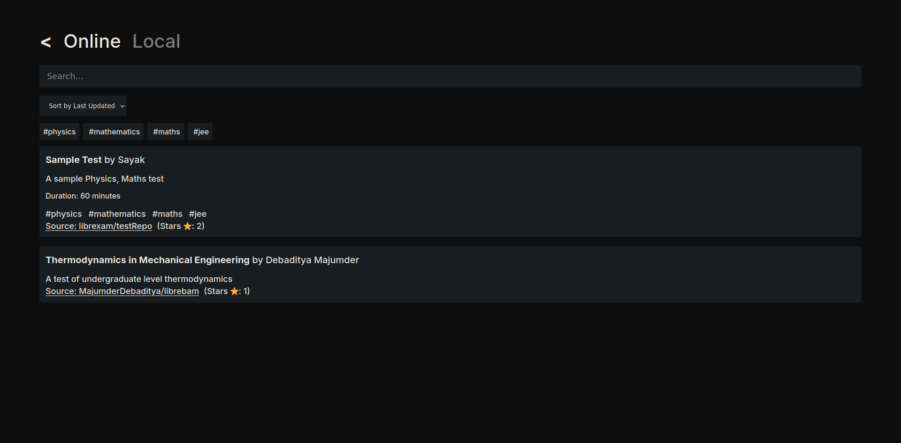
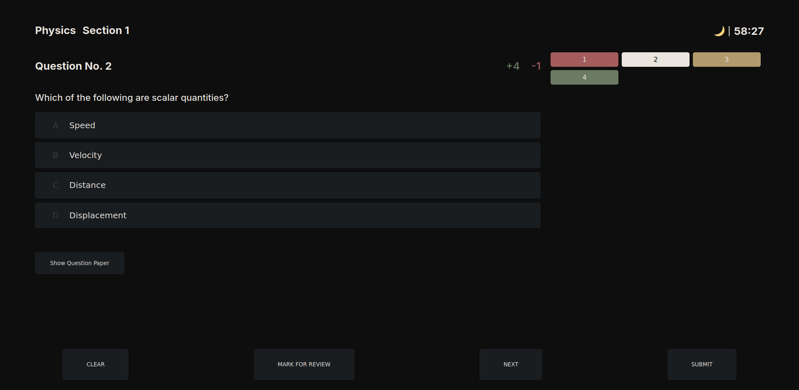

    

    
    
    
    

is a powerful, fully static, and (optionally) decentralised test and quizzing engine - powered by Vue.js.

The project is very much WIP and still alpha.

## Philosophy

Mock tests are an integral part of a students life. This app allows students to interact with community contributed tests.

All tests and quizzes are typed out in JSON, making distribution incredibly easy.

A collection of tests can be hosted in a repo, and can be indexed, with the index link being shared - effectively allowing decentralised hosting of tests.

Even though images for questions currently need to be hosted (using a service like ImgBB, for example), then linked separately - A feature where each test JSON is bundled into a zip together with its own assets folder might be implemented - thus practically making the entire thing decentralised.

### Why Vercel?

To boost early-adoption of the software while minimizing investment of resources from my behalf.

## Features

- Test browsing (indexed repos)
- Ability to manage multiple tests (paused or submitted)
- Supports SMCQ, MMCQ and Numerical questions
- Supports marking questions for review
- Ability to load images for questions
- KaTeX support
- A dark theme/light theme toggle
- A rudimentary results page

### To be done

- A more advanced results page
- Ability to track user stats
- A better UI (....)
- Code optimization
- A functioning WYSIWYG test maker _(maybe...)_
- Bundling tests into zips, along with their images _(maybe...)_
- Audio support

## Contribution

### Prerequisites

- Node.js
- npm
- git

### Instructions

1. Clone the `main` branch  
   `git clone https://github.com/sayakdattagupta/librexam.git`
2. Install dependencies  
   `npm install`
3. Run `npm run dev`

### Guidelines

(Firstly, the obvious: Don't make any breaking changes.)

This project uses the `prettier` code format. Make sure to run

`npx prettier --write .`

from the root before making a pull request.

## LICENSE

[AGPLv3](LICENSE) - Free to use, modify, and share. However, Source code must be disclosed if deployed publicly.
