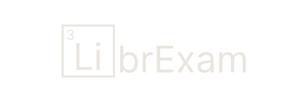

## [LibrExam](https://librexam.vercel.app)

 
is a powerful, fully static, and (optionally) decentralised test and quizzing engine - powered by Vue.js. 

The project is very much WIP and still alpha.

Also, check out the [repo](https://github.com/librexam/testRepo) where I am hosting the sample tests.

## Philosophy

I realize this project might not exactly be 'libre', hence, to avoid any potential feuds, I have used a creative naming scheme (LibrE).

All tests and quizzes are typed out in JSON, making distribution incredibly easy.

A collection of tests can be hosted in a repo, and can be indexed, with the index link being shared - effectively allowing decentralised hosting of tests.

Even though images for questions currently need to be hosted (using a service like ImgBB, for example), then linked separately - A feature where each test JSON is bundled into a zip together with its own assets folder might be implemented - thus practically making the entire thing decentralised.

### Why Vercel?

To boost early-adoption of the software while minimizing investment of resources from my behalf.

## Features

Test browsing (indexed repos), 
Ability to manage multiple tests (paused or submitted), 
Supports SMCQ, MMCQ and Numerical questions, 
Supports marking questions for review,  
Ability to load images for questions, 
KaTeX support, 
A dark theme/light theme toggle, 
A rudimentary results page 

### To be done

A more advanced results page,  
Ability to track user stats,  
A better UI (....),  
Code optimization,  
A functioning WYSIWYG test maker _(maybe...)_,  
Bundling tests into zips, along with their images _(maybe...)_, 
Audio support

## LICENSE

[AGPLv3](LICENSE) - Free to use, modify, and share. However, Source code must be disclosed if deployed publicly.
